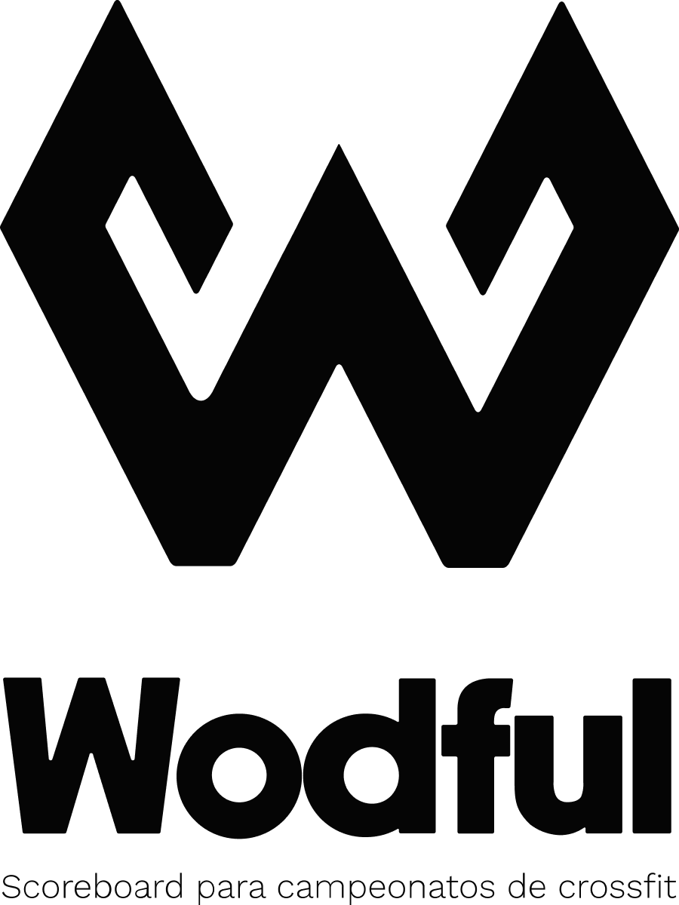
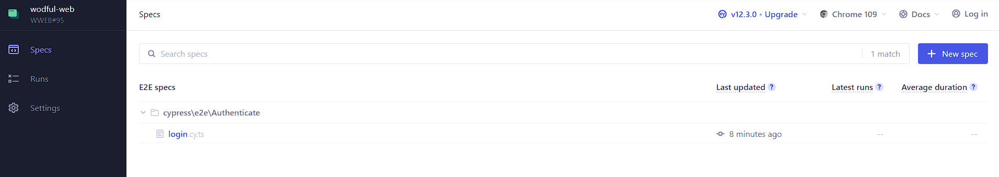

# Wodful web

    

> This document will help you set your ambient to run Wodful web

Remember this application is the front-end part of Wodful, to run all the project you need run the back-end project too on this link: [back-end](https://github.com/EXtreme-go-horse-club/wodful-api).

## Used tecnologies

1. JavaScript;
2. Typescript
3. Chakra;
4. Axios;
5. Prettier;
6. ESLint
7. Vite;
8. Cypress

## Setup Installation

1. Clone this repo;
2. We strong recommend you install and use `yarn`;
3. Run `yarn` in the terminal to install all the dependeces;
4. Run `yarn dev` in the terminal to start the project;
5. In your browser change `http://127.0.0.1:3000/` to `http://localhost:3000/`;

## Running tests

This web application works with cypress to perform batteries of e2e integration tests. To run the batteries:

1. Make sure you have run the `yarn` command to install all project dependencies.
2. Run `yarn cy:e2e` to start the cypress interface.
3. Choose and run the desired test battery.

